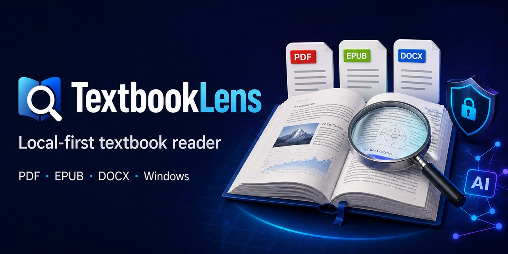
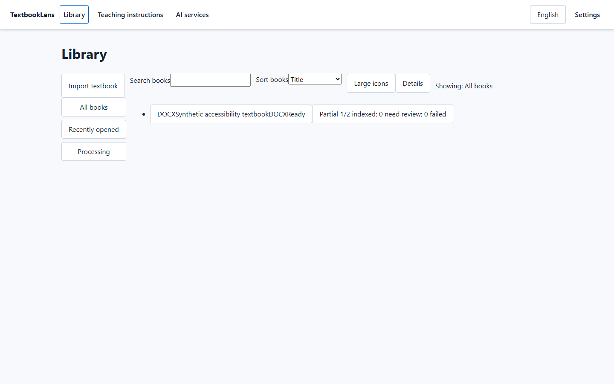

<div align="center">



# TextbookLens

**Read PDF, EPUB, and DOCX textbooks in one private, local-first Windows app.**

[](https://github.com/gh615280-maker/TextbookLens/actions/workflows/ci.yml)
[](https://github.com/gh615280-maker/TextbookLens/releases/latest)
[](https://github.com/gh615280-maker/TextbookLens/releases)
[](LICENSE)
[](https://github.com/gh615280-maker/TextbookLens/releases/latest)

[**Download for Windows**](https://github.com/gh615280-maker/TextbookLens/releases/latest) · [中文说明](README.zh-CN.md) · [User guide](docs/user-guide.md) · [Roadmap](ROADMAP.md)

</div>

## Why TextbookLens?

- **One focused library:** import PDF, EPUB, and DOCX books without juggling separate readers.
- **Local-first by design:** your library, reading progress, notes, indexes, and backups stay on your device.
- **AI only when you ask:** optional AI actions send content only after you explicitly start them; ordinary reading and search do not need AI.
- **Built for long-form study:** local search, annotations, reading history, multilingual UI, backup, and restore live in one desktop workflow.
- **Open and modifiable:** the complete Rust + React + Tauri source is available under Apache-2.0.

<div align="center">



<sub>Actual application interface shown with synthetic test data.</sub>

</div>

## Download and use

1. Open the [latest release](https://github.com/gh615280-maker/TextbookLens/releases/latest).
2. Download `TextbookLens_*_x64-setup.exe` for the simplest installation. An MSI package is also available for managed installation.
3. Optionally verify the download with `SHA256SUMS.txt` from the same release.
4. Install, launch, and choose a PDF, EPUB, or DOCX file.

> [!IMPORTANT]
> Current packages are unsigned and support Windows 11 x64 only. Windows SmartScreen may show an unknown-publisher warning. Verify the checksum before choosing **Run anyway**.

## Privacy boundary

TextbookLens has no account system, cloud sync, bundled AI credit, project proxy, or collaboration service. API keys are stored through Windows Credential Manager rather than the application database, browser storage, logs, diagnostics, or backups.

Importing, reading, local search, annotations, language changes, backup, and restore do not require an AI request. For the exact provider and data-sending rules, see [AI services and sending boundary](docs/ai-services.md). Storage, deletion, and recovery behavior are documented in [Data, backup, restore, and deletion](docs/data-backup.md).

## For developers

TextbookLens uses React 19, TypeScript, Tauri 2, Rust, and SQLite. To run the source:

```powershell
git clone https://github.com/gh615280-maker/TextbookLens.git
cd TextbookLens
npm ci
npm run tauri dev
```

The pinned development toolchain is Node.js 24.18.1, npm 11.16.0, and Rust 1.97.1, plus the Windows desktop prerequisites for Tauri 2. Run `npm run preflight` for the release-oriented validation suite and `npm run tauri build` to produce local NSIS/MSI installers.

Before changing data, credentials, networking, fixtures, or generated bindings, read [CONTRIBUTING.md](CONTRIBUTING.md). Dependency provenance and notices are recorded in [LICENSES.md](LICENSES.md) and [THIRD_PARTY_NOTICES.md](THIRD_PARTY_NOTICES.md).

## Project status

TextbookLens is an early public release. Version 0.1.0 passed the documented local unsigned V1 release gate, with known exceptions around code signing, automatic updates, and several manual accessibility/provider checks. See the [release checklist](docs/release-checklist.md) for precise evidence and limitations.

Ideas and bug reports are welcome through [GitHub Issues](https://github.com/gh615280-maker/TextbookLens/issues). For planned directions, see the [roadmap](ROADMAP.md).

If TextbookLens is useful to you, **star the repository** so more readers and contributors can find it.
